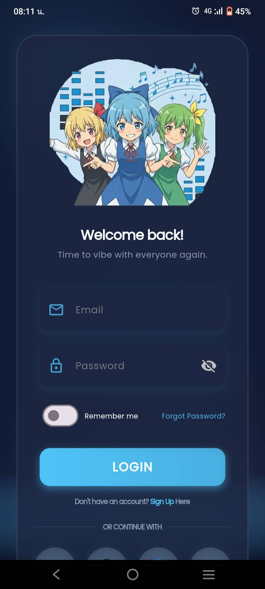
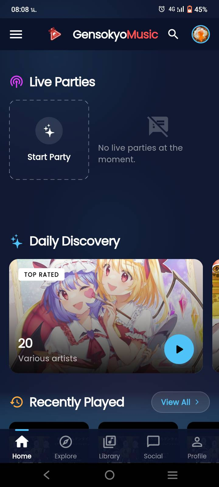
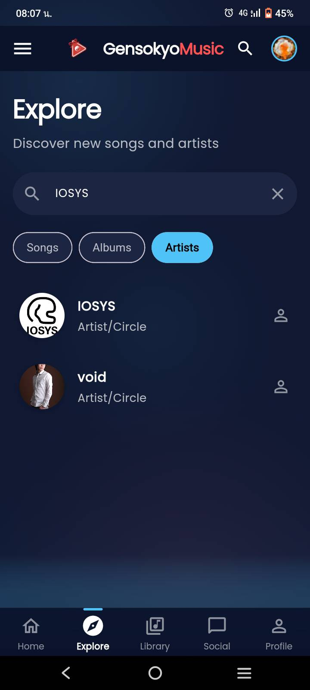
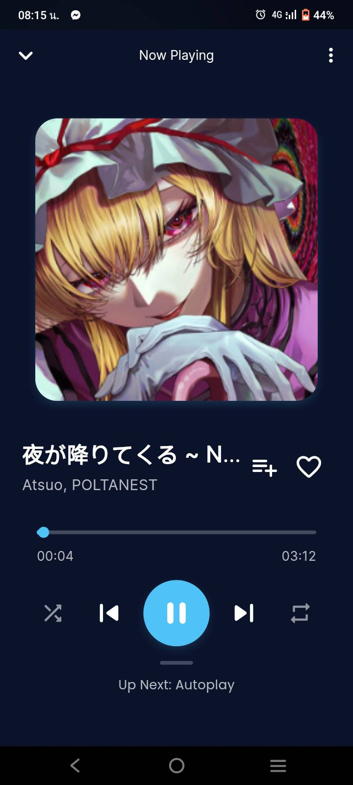
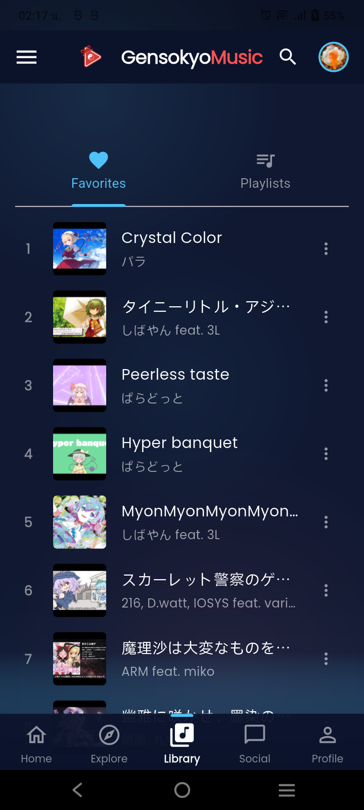
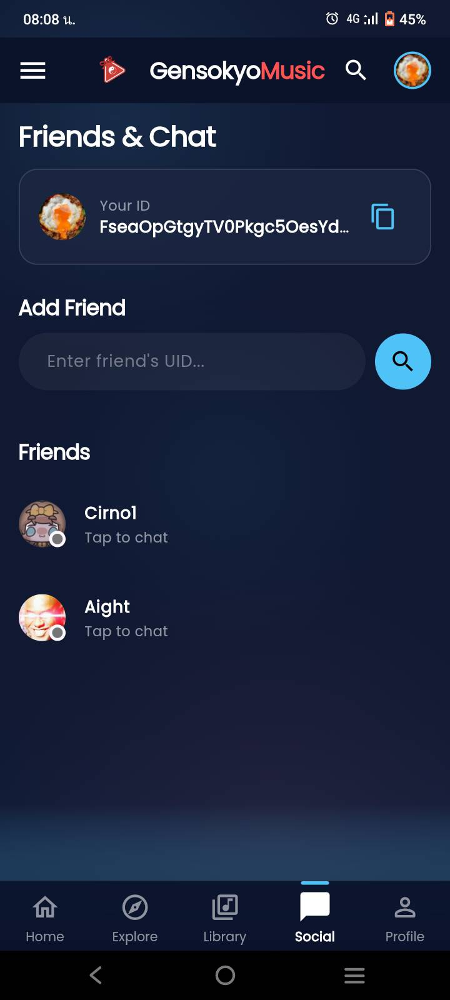
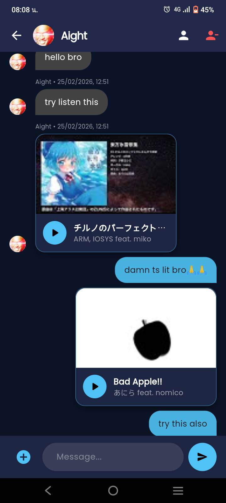
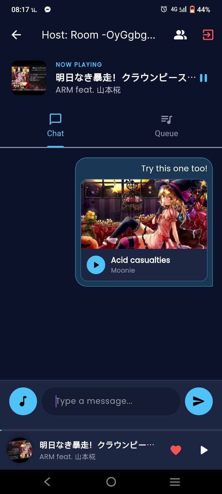
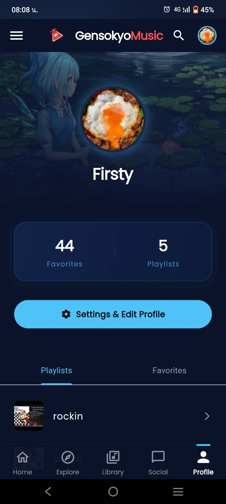

# GensokyoMusic

GensokyoMusic is a Touhou-focused social music streaming app built with
Flutter. Explore songs, albums, and circles through TouhouDB, play available
tracks from YouTube, organize a personal library, chat with friends, and listen
together in synchronized Live Parties.

> [!NOTE]
> GensokyoMusic is currently a development project. TouhouDB provides the
> community-maintained music metadata, while audio is streamed from YouTube.
> This repository does not host or redistribute the audio.

## App tour

<table>
  <tr>
    <td align="center">
      <br>
      <sub><b>Welcome back</b></sub>
    </td>
    <td align="center">
      <br>
      <sub><b>Home & discovery</b></sub>
    </td>
    <td align="center">
      <br>
      <sub><b>Explore the catalog</b></sub>
    </td>
  </tr>
  <tr>
    <td align="center">
      <br>
      <sub><b>Now playing</b></sub>
    </td>
    <td align="center">
      <br>
      <sub><b>Your library</b></sub>
    </td>
    <td align="center">
      <br>
      <sub><b>Find friends</b></sub>
    </td>
  </tr>
  <tr>
    <td align="center">
      <br>
      <sub><b>Share songs in chat</b></sub>
    </td>
    <td align="center">
      <br>
      <sub><b>Listen together</b></sub>
    </td>
    <td align="center">
      <br>
      <sub><b>Make it yours</b></sub>
    </td>
  </tr>
</table>

<p align="center"><sub>Captured from the Android app.</sub></p>

## Download for Android

Download the latest signed APK from
[GitHub Releases](https://github.com/Firstyye/GensokyoMusic/releases/latest).

Android might ask you to allow installs from your browser or file manager
because this APK is distributed directly rather than through Google Play.
Future updates must be signed by the same GensokyoMusic release key.

## Features

### Discover Touhou music

- Browse recommended songs, genre selections, top-rated albums, and popular
  circles.
- Search TouhouDB across songs, albums, and artists.
- Open artist and album pages, inspect track lists, and play the available
  YouTube-linked tracks.
- Return to the latest 20 recently played songs from the home screen.

### Native music playback

- Mini-player and full-screen player experiences powered by `just_audio`.
- Play/pause, seek, previous/next, queue selection, shuffle, loop-one,
  loop-all, and autoplay controls.
- Automatic recommendations can extend the queue when autoplay is enabled.
- The next track is prefetched, and Android media notifications/background
  playback are initialized through `just_audio_background`.

### Personal library

- Save or remove favorite songs.
- Create, open, play, and delete playlists.
- Add individual songs or all playable tracks from an album to a playlist.
- Remove songs from an existing playlist.
- Favorites, playlists, and listening history sync through Cloud Firestore.

### Live Parties

- Create a listening room with an optional starting song or join one with its
  room code.
- Keep listeners synchronized with the host's song, play/pause state, seek
  position, and shared queue.
- Chat inside a party, attach searchable songs, and view participants.
- Transfer host status to the longest-present listener when the current host
  leaves; empty rooms are removed automatically.
- Browse currently active public rooms from the home screen.

### Friends and messaging

- Find users by Firebase UID, send/accept friend connections, and remove
  friends.
- See online presence and open public profiles.
- Exchange real-time private messages.
- Search TouhouDB from a conversation and send a playable song card.
- Protect favorites and playlists with profile privacy mode.

### Accounts and profiles

- Register or sign in with email and password.
- Password reset, remember-me behavior, and first-login onboarding.
- Google, GitHub, Facebook, and Twitter authentication flows.
- Edit the display name, avatar, and profile banner.
- View a profile's favorites, playlists, account age, and library statistics.

## How it works

| Area | Implementation |
| --- | --- |
| App and UI | Flutter, Dart, Material widgets, custom dark/glass UI |
| Music catalog | TouhouDB REST API |
| Audio | `just_audio` with streams resolved by `youtube_explode_dart` |
| Accounts | Firebase Authentication |
| Library and profiles | Cloud Firestore |
| Parties, chat, and presence | Firebase Realtime Database |
| Profile images | Image Picker and an unsigned Cloudinary upload preset |
| Local preferences | SharedPreferences |

The main data flow is:

1. `TouhouDBService` retrieves music metadata and available YouTube video IDs.
2. `AudioPlayerService` resolves playable audio, owns the queue, and exposes
   playback state to the mini-player, full player, and Live Party screens.
3. `FirestoreService` persists user profiles, friendships, favorites,
   playlists, and recently played songs.
4. `RealtimeDatabaseService` handles party state, shared queues, chat, private
   messages, participants, and presence.

## Platform status

| Platform | Repository status |
| --- | --- |
| Android | Flutter target and Firebase configuration included |
| iOS | Flutter target and Firebase configuration included |
| macOS | Flutter target and Firebase configuration included |
| Windows | Flutter target and Firebase configuration included |
| Web | Flutter target and Firebase configuration included |
| Linux | Flutter target exists, but Firebase is not configured |

These entries describe repository configuration, not release certification on
every platform. Linux currently throws an `UnsupportedError` during Firebase
startup until it is added with the FlutterFire CLI.

## Getting started

### Requirements

- Flutter 3.38.3 with Dart 3.10.1, or a compatible newer toolchain
- A device or emulator supported by Flutter
- Internet access for Firebase, TouhouDB, YouTube, and remote images
- Firebase/Cloudinary access if you plan to replace the existing backend

### 1. Install dependencies

From the repository root:

```bash
flutter pub get
```

### 2. Create the required environment asset

The project declares `.env` as a Flutter asset, so the file must exist before
an app or test bundle can be built. It is ignored by Git.

PowerShell:

```powershell
Copy-Item .env.example .env
```

macOS/Linux shell:

```bash
cp .env.example .env
```

Do not place production API secrets in this file: Flutter assets are bundled
with the client application. The current avatar/banner implementation uses the
unsigned Cloudinary cloud and upload preset defined in
`lib/pages/settings_screen.dart`; the `CLOUDINARY_URL` value is not currently
used by that upload request.

### 3. Configure Firebase when using your own project

The committed configuration points to the Firebase project used during
development. A fork using a different backend should:

1. Run `flutterfire configure` for the intended platforms.
2. Replace the generated platform configuration and
   `lib/firebase_options.dart`.
3. Enable Email/Password, Google, GitHub, Facebook, and Twitter providers as
   needed in Firebase Authentication.
4. Create Cloud Firestore and Realtime Database instances with rules that
   support the data used by `FirestoreService` and
   `RealtimeDatabaseService`.

### 4. Run the app

```bash
flutter devices
flutter run -d <device-id>
```

For example:

```bash
flutter run -d windows
flutter run -d chrome
```

Provider sign-in and background audio behavior can vary by platform and require
the corresponding native/provider configuration.

### Build a signed Android release

Release builds require the ignored `android/key.properties` file and the
private keystore it references:

```powershell
flutter pub get
flutter build apk --release
```

The APK is written to
`build/app/outputs/flutter-apk/app-release.apk`. Never commit the keystore,
`android/key.properties`, `.env`, or generated APKs.

## Project structure

```text
lib/
├── main.dart          # App startup, Firebase, preferences, and audio setup
├── pages/             # Authentication, navigation, player, library, and social UI
├── services/          # Audio, Firestore, and Realtime Database state
├── data/              # TouhouDB access and catalog view models
├── models/            # Shared domain models such as SongInfo
├── widgets/           # Reusable player, song, search, and settings widgets
├── components/        # Shared visual backgrounds
└── constant/          # Colors, typography, and shared dialogs

assets/
├── icons/
└── images/
```

## Development checks

```bash
flutter analyze
flutter test
```

Current baseline as checked with Flutter 3.38.3:

- `flutter analyze` reports 118 existing findings. Most are lint,
  deprecation, async-context, and naming findings; one is the missing `.env`
  asset before the setup step above is completed.
- `flutter test` cannot build without `.env`. With a placeholder `.env`, the
  remaining widget test still fails because it is Flutter's original counter
  template test and does not describe the current application.

These are existing project issues; replacing the placeholder test and reducing
the analyzer backlog are separate from this README update.

## Data sources and content

- Music metadata and artwork references are retrieved from the
  [TouhouDB API](https://touhoudb.com/).
- Playable audio is resolved from YouTube links present in TouhouDB records.
- Firebase stores account-related application data; Cloudinary hosts uploaded
  profile images.

GensokyoMusic is an unofficial fan project. Availability depends on the
external services and on each catalog entry having an enabled YouTube link.
